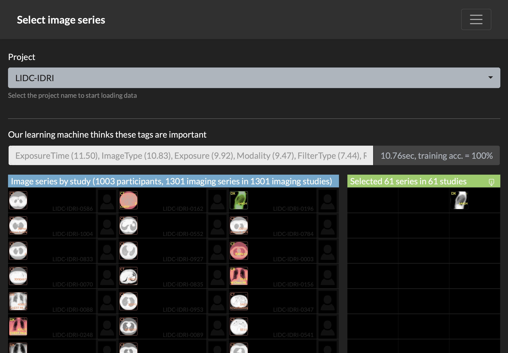

# Filter DICOM data by DICOM tags

Research medical imaging data is complex. Luckily, the DICOM standard provides structured information on the project level in each image file. As many processing pipelines require a subset of the collected data this project will help export data appropriate for a processing or data sharing task.

The user visually selects samples of the data he/she wants to export. From this sample the application learns a model that is applied to all data of the project. By providing a small number of examples all image series in all studies of the project are classified interactively.



### Setup the program

Create a docker container by running
```
docker build -t filter_dicom_by_tag -f Dockerfile .
```
in the directory of this project.

Start the container like this:
```
docker run --rm -d -p 80:80 -v /my/folder/with/projects:/data filter_dicom_by_tag 
```
Here we assume that a folder with DICOM images is in the /my/folder/with/projects folder on your local disk. The structure of this folder is not important. One of the nice things about DICOM is that all the information is in the header. You do not have to sort files into specific folders or name the files in a specific way. Open a web-browser on your local machine to start the interface:
```
open http://localhost:80/
```

# Usage

The interface lists all folders found in the data directory as individual projects. The first time such an entry is selected from the Project dropdown the system will create a project representation required for the visualization and AI processing. This process may take a long time (hours, see progressbar) as each DICOM file is checked in the folder and meta data is extracted from it. Once this process is finished a cache of the project is available and future calls to the same project will be much faster (seconds).

Reloading the application after the cache has been created should show all the image series for each study in the project on the left-hand side of the interface. The result of any selection is displayed on the right-hand side.

Teaching the application what image series you want is done by providing pairs of examples. Select an image you want using left mouse click. Follow this by Shift+left-click an image that you don't like to have in your result. Continue this process until the column on the right shows the correct number and type of selected series.

Export the selection as a spreadsheet using the download-icon on the columns labelled "Selected".

### Tips

 - Try to keep the number of "love" and "hate" selections balanced.
 - Each selection of "love" and "hate" forces an asynchronous recalculation of the model training and prediction step. Based on the number of series and the available DICOM tags the processing time can be a couple of seconds and learning of different steps may overlap. Wait until the system is done and do a single additional selection to show the correct selection.
