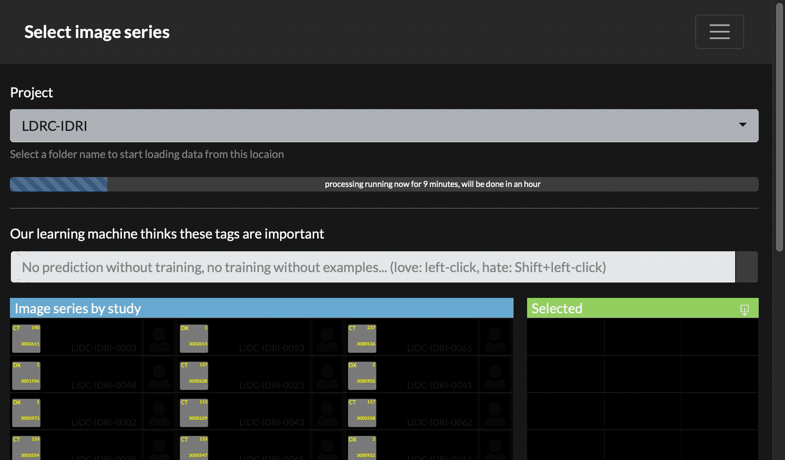

# Filter DICOM data by DICOM tags

Research medical imaging data is complex. Luckily, the DICOM standard provides structured information on the project level in each image file. As many processing pipelines require a subset of the collected data this project helps exporting data appropriate for a processing or data sharing task.

The user visually selects samples of the data he/she wants to export. From this sample the application learns a model that is applied to all data of the project. By providing a small number of examples and by continuously running the model training and prediction steps all image series in all studies of the project are classified.


In the image above selected icons with "love" are in green and "hate" icons selected with Shift+left-mouse are in red. A single image series is selected on the right. The selection only included "love" examples for a sagittal DX.

### Setup

Clone this repository and create a docker container (requires git and docker installed) by running
```
git clone https://github.com/mmiv-center/filter_dicom_by_tag.git
cd filter_dicom_by_tag
docker build -t filter_dicom_by_tag -f Dockerfile .
```
from the command line.

Start the container like this:
```
docker run --rm -d -p 80:8888 -v /my/folder/with/projects:/data filter_dicom_by_tag 
```
Here we assume that a folder with DICOM images is in the /my/folder/with/projects folder on your local disk. The structure of this folder is not important. One of the nice things about DICOM is that all the information are in the header. You do not have to sort files into specific folders or name the files in a specific way. Open a web-browser on your local machine to start the interface:
```
open http://localhost:80/
```

# Usage

The interface lists all folders found in the data directory as individual projects. The first time such an entry is selected from the Project dropdown the system will create a project representation required for the visualization and AI processing. This process may take a long time (hours, see progressbar) as each DICOM file is checked in the folder and meta data is extracted from it. Once this process is finished a cache of the project is available and future calls to the same project will be much faster (seconds).



Reloading the application after the cache has been created should show all the image series for each study in the project on the left-hand side of the interface. The result of any selection is displayed on the right-hand side.

Teaching the application what image series you want is done by providing pairs of examples. Select an image you want using left mouse click. Follow this by Shift+left-click an image that you don't like to have in your result. Continue this process until the column on the right shows the correct number and type of selected series.

Export the selection as a spreadsheet using the download-icon on the columns labelled "Selected". There are two different ways to export the data. Either a spreadsheet with the selected StudyInstanceUID's and SeriesInstanceUID's is created or a full copy of the data in the output "exports" folder (see how to setup the shared folder in the Tips section).

## Share your knowledge

It turns out, that for normal DICOM data many tags can be used to get equivalent models, i.e. models that provide identical selections for a given project. We will call such models, equivalent models or models that belong to the same equivalence class. Up to 11 different models are created by the training step using an iterative process of successively removing terms from the training data that appear in previous models. All models in the equivalence class are available for inspection using the "previous"/"next" buttons above the list of model variables once sufficient training data has been selected. 

If models are found to be in the same equivalence class for a given project we can use this to establish a distance between any model (across projects). Such a distance between models is a useful tool as it establishes an empirically distance between different DICOM tags and a distance between models that is purely driven by data observed <i>in the wild</i>.

Equivalence classes (collections of models providing the same classification) can be shared between projects. The user can upload an equivalence class to a central repository by providing i) an ontology name based on the DCM and IOBC ontologies (BioPortals, requires a working internet connection) and ii) by specifying a user identifier.

<b>Goal</b>: If this is done by a sufficient number of people for a sufficiently diverse group of projects we can hope to use this similarity metric to automatically classify DICOM data. This can be done based on a set of classifications that split the image series of a project into a hierarchy where each series is successfully classified. In such a hierarchy of classification models we expect modality type classes (a.k.a. "This is an MRI") to appear at the root of the hierarchy whereas individual classes like "Localizer" appear further down. The goal of this project is therefore to empirically discover the classes and their hierarchy in order to provide a fully automated classification for real world DICOM series.

### Tips

 - Try to keep the number of "love" and "hate" selections balanced.
 - Each selection of "love" and "hate" forces an asynchronous recalculation of the model training and prediction step. Based on the number of series and the available DICOM tags the processing time can be a couple of seconds and learning of different steps may overlap. Wait until the system is done and do a single additional selection to show the correct selection.
 - In order to have the data cache saved outside of the container you can mount the folder during startup of the container. This way the cache is outside of the container and stopping docker does not remove the cache. The same setup needs to be used to make the export folder visible to the outside of the container.
```
  mkdir cache
  mkdir exports
  docker run --rm -d -p 80:80 -v /my/folder/with/projects:/data \
                              -v `pwd`/cache:/var/www/html/php/project_cache \
                              -v `pwd`/exports:/var/www/html/php/exports filter_dicom_by_tag 
```
 - In some environments port 80 is already in use. Change the Dockerfile and use an alternative port
 for the integrated website.
 - In order to be able to see the website outside of the docker environment
 start a local docker with '--network host' instead of providing the '-p' argument. This will run
 the system on the hosts network and thus make it accessible to external users.
 - As an observation: If you run the docker container on MacOS and you mount external folders 
 you will need to wait quite some time before an existing project is loaded. Partially this is
 caused by a slow file copy between the docker environment running Linux and the MacOS file system.
 It is faster to run this software on Linux.